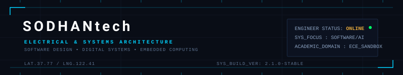

# SODHANtech — Engineering Portfolio

<p align="center">
  
</p>

<p align="center">
  <a href="https://github.com/SODHANtech"></a>
  <a href="https://www.linkedin.com/in/sodhan-krishna-sai-b92079220/"></a>
  
</p>

---

## 🖥️ SYSTEM STATUS
```text
━━━━━━━━━━━━━━━━━━━━━━━━━━━━━━━━━━━━━━━━━━━━━━━━━━━━━━━━━━━━━━━━━━━━
USER ID     → SODHANtech (Sodhan Krishna Sai)
ROLE        → Student & Software Developer
SECTOR      → Electronics & Communication Engineering (ECE)
SPECIALTY   → Full-Stack Web Development & Multi-Agent AI Systems
CURRENTLY   → Engineering Interactive 3D Web UI & Orchestrating LLMs
STATUS      → BUILD MODE ACTIVE [Searching for Internships & Projects]
━━━━━━━━━━━━━━━━━━━━━━━━━━━━━━━━━━━━━━━━━━━━━━━━━━━━━━━━━━━━━━━━━━━━
```

---

## 🚀 FLAGSHIP PROJECTS

### 1. [CampusOS AI (agentx)](https://github.com/SODHANtech/agentx)
*Multi-Agent Academic Assistant & Coordinator*
```text
Orchestration  → LangGraph Workflow Engine
Backend API    → FastAPI (Python)
Frontend UI    → React (Vite) + Tailwind CSS
State Database → SQLite (campus.db)
```
- **What it solves:** An AI assistant that routes student queries and admin tasks to specialized agents (Academics, Placements, Events, Student Services, etc.) in a structured graph.
- **Key Detail:** Utilizes LangGraph state management to coordinate multi-agent reasoning, avoiding circular loops and ensuring correct database updates.
- **Current Status:** Core backend nodes and UI routes operational.

### 2. [3D/HUD Cyber Portfolio](https://github.com/SODHANtech/portfolio)
*Futuristic 3D Developer Dossier*
```text
3D Interface   → Three.js (raw WebGL integration in React) + Framer Motion
Web Backend    → Node.js + Express
Object Storage → MongoDB GridFS
Delivery Node  → Nodemailer SMTP Service
```
- **What it solves:** A portfolio representing user telemetry, skills (visualized as a "Katana Rack"), and journey checkpoints.
- **Key Detail:** Integrates Node.js streaming to load binary images directly from MongoDB GridFS buckets and includes complete Three.js garbage collection to prevent web memory leaks.
- **Current Status:** Staging setup complete, supports dynamic admin uploads and live messaging.

---

## 📊 REPOSITORY SHOWCASE

| Project | Type / Class | Stack | Description |
| :--- | :--- | :--- | :--- |
| [**agentx**](https://github.com/SODHANtech/agentx) | **FLAGSHIP** | FastAPI, LangGraph, React, SQLite | Multi-agent cooperative campus assistant workflow. |
| [**portfolio**](https://github.com/SODHANtech/portfolio) | **FLAGSHIP** | React, Three.js, Express, MongoDB GridFS | Interactive 3D cybernetic terminal portfolio. |
| [**cricket-match-analytics**](https://github.com/SODHANtech/cricket-match-analytics) | **SUPPORTING** | Python, Matplotlib, Seaborn, NumPy | Matches data processor & multi-page PDF report compiler. |
| [**stdent-management**](https://github.com/SODHANtech/stdent-management) | **EXPERIMENTAL** | Python, Flask, SQLite, SQLAlchemy | Academic dashboard sandbox for database-driven models. |
| [**hexoelite**](https://github.com/SODHANtech/hexoelite) | **ARCHIVED** | Markdown | Static environment repository. |

---

## ⚡ CORE SKILLS & TECH STACK

### 🔌 Electrical & Hardware Engineering (ECE)
`MATLAB` • `Signal Processing` • `Analog Electronics` • `Circuits & Logic Design`

### 💻 Programming Languages
`Python` • `JavaScript` • `SQL` • `HTML5 / CSS3`

### 🌐 Software & Web Development
*   **Frontend Frameworks:** `React (SPA)` • `Three.js (WebGL)` • `Vite` • `Tailwind CSS` • `Framer Motion`
*   **Backend & Databases:** `FastAPI` • `Node.js` • `Express` • `Flask` • `MongoDB` • `SQLite` • `SQLAlchemy` • `Mongoose`
*   **AI & Data Science:** `LangGraph (Agentic Workflows)` • `Seaborn` • `Matplotlib` • `NumPy`

---

## 📊 STATISTICS & METRICS

<p align="center">
  
  
</p>

<h3 align="center">CONTRIBUTION ACTIVITY</h3>
<p align="center">
  <!-- This points to the SVG generated by the daily GitHub Action workflow on the 'output' branch -->
  <picture>
    <source media="(prefers-color-scheme: dark)" srcset="https://raw.githubusercontent.com/SODHANtech/SODHANtech/output/github-contribution-grid-snake-dark.svg">
    <source media="(prefers-color-scheme: light)" srcset="https://raw.githubusercontent.com/SODHANtech/SODHANtech/output/github-contribution-grid-snake.svg">
    
  </picture>
</p>

---

## 🔗 CONTACT & LINKS
*   **LinkedIn:** [linkedin.com/in/sodhan-krishna-sai-b92079220](https://www.linkedin.com/in/sodhan-krishna-sai-b92079220/)
*   **GitHub:** [github.com/SODHANtech](https://github.com/SODHANtech)
*   **Direct Contact:** Messaging channel via the contact module on the [3D Portfolio](https://github.com/SODHANtech/portfolio).
